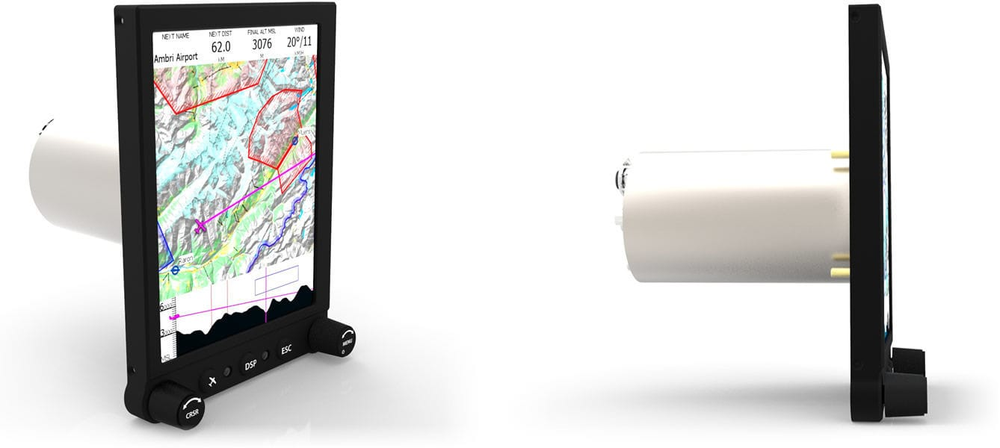

# meta-glide
This is a layer for OpenEmbedded to support the AIR Glide Display L hardware.



Features:
* Run Embedded Linux (Colibri-T30_Console-Image 2.8b7)
* Support for CAN Bus
* Run XCSoar with CANaerospce Device (https://github.com/ubx/XCSoar/tree/can-bus)
* Support for rotary knobs and buttons. 
* Support backlight adjustment.
* Support for touch screen.
* Configuration menu.

## Project status
| Feature | Status | Notes |
--- | --- | ---
| Embedded Linux | Good |  |
| CAN | Good |  |
| Rotary knobs | Good | |
| Buttons | Good | |
| XCSoar | Need Improvements | Key assignment, proper shutdown |
| Touch screen | wip | Implement as a Kernel Modul |
| Colibri T30 | Works on eval. board | Power up issue on Display L|
| Colibri T20 | Good | |
| Config. menu | not defined yet | |

[Here a short video (with NMEA input via serial port)](https://youtu.be/IahGqsdgllc)

## Embedded Linux
The generated Embedded Linux contains also a ready to run XCSoar.
#### Build the docker image:

 ``````
 cd docker
 docker build -f Dockerfile . -t toradex-yotco
 ``````
#### Run docker:

 ``````./run_dock.sh``````

#### Get the toradex configurations in the docker 
image at /home/yocto/oe-core, this is the mounted folder if you run with ``````./run_dock.sh``````):

``````
git config --global user.email "you@example.com"
git config --global user.name "Your Name"
repo init -u http://git.toradex.com/toradex-bsp-platform.git -b LinuxImageV2.8
``````

#### Update/fetch the repos:

`repo sync`

#### Setup the bitbake environemnt:

`. export`

#### Now one can build the toradex colibri t30 image:

`bitbake console-tdx-image`

or for colibri t20 image:

`MACHINE="colibri-t20" bitbake console-tdx-image`

or build only xcsoar:

`bitbake xcsoar-7.0`
 
>This is all heavily inspired / copy and pasted from:
> 1. <https://developer.toradex.com/knowledge-base/board-support-package/openembedded-(core)>
> 2. the webinars found within the above page
> 3. <https://github.com/Openvario/meta-openvario>


#### Then you can populate the sdk, so one can cross-compile by hand (I think):

``````bitbake angstrom-lxde-image -c populate_sdk``````

#### You can now also generate a SD Card or a USB stick to deploy onto the board:
1. unpack the generated image found here (as sudo to maintain the folder structure)
  $BASEDIR/oe-core/deploy/images/colibri-t30/
2. go to the directory you unpacked it and run the update script:
``````
./update.sh -o <sdcard>
``````

3. On the target's HW-console do:

#### Or if your target HW has an Ethernet connection, and you have an TFTP Server on the development machine:
you can deploy the generated image via TFTP:
1. unpack the generated image found here (as sudo to maintain the folder structure)
   $BASEDIR/oe-core/deploy/images/colibri-t30/
2. go to the directory you unpacked it and run the update script:
``````
./update.sh -o /tftp
``````
where "/tftp" is your TFTP_DIRECTORY.

3. On the target's HW-console do:
``````
usb start
setenv autoload 0
dhcp
setenv serverip <server-ip address> (setenv serverip 192.168.1.104)
ping ${serverip}
run setupdate
run update
``````

#### Example Logs
[build.log](documents/logs/build.log)

[deployToSDCard.log](documents/logs/deployToSDCard.log)

[deployToTFTP.log](documents/logs/deployToTFTP.log)

> How to put the board in Recovery Mode:
> 1. Connect the serial port UART_B. (normally it is UART_A, but we use UART_B)
> 2. Open a terminal on your host computer (115200 baud, 8 data bits, no parity, one stop, no hardware/software flow control).
> 3. Power cycle the board and immediately press [space] on the terminal
> 
>For a detailed description see [Txx Recovery Mode](https://developer.toradex.com/knowledge-base/txx-recovery-mode#1-colibri-t30)

[flashViaSDCard.log](documents/logs/flashViaSDCard.log)

> For flashing via TFTP be sure the board is connected with an ethernet cable.

[flashViaTFTP.log](documents/logs/flashViaTFTP.log)

### Test a specific Layer (here the Kernel Module *arrowkey-mod*)
[See also yocto documentation](https://wiki.yoctoproject.org/wiki/index.php?title=TipsAndTricks/Patching_the_source_for_a_recipe&oldid=61374)
``````
devtool modify arrowkey-mod
``````
edit file(s) in *oe-core/build/workspace/sources/arrowkey-mod/*
``````
bitbake arrowkey-mod
devtool deploy-target -s arrowkey-mod root@192.168.1.116
devtool reset arrowkey-mod
``````
> After that, don't forgett to remove */home/yocto/oe-core/build/workspace* in bblayers.comf
## Problems
### CAN on Display-L Board

